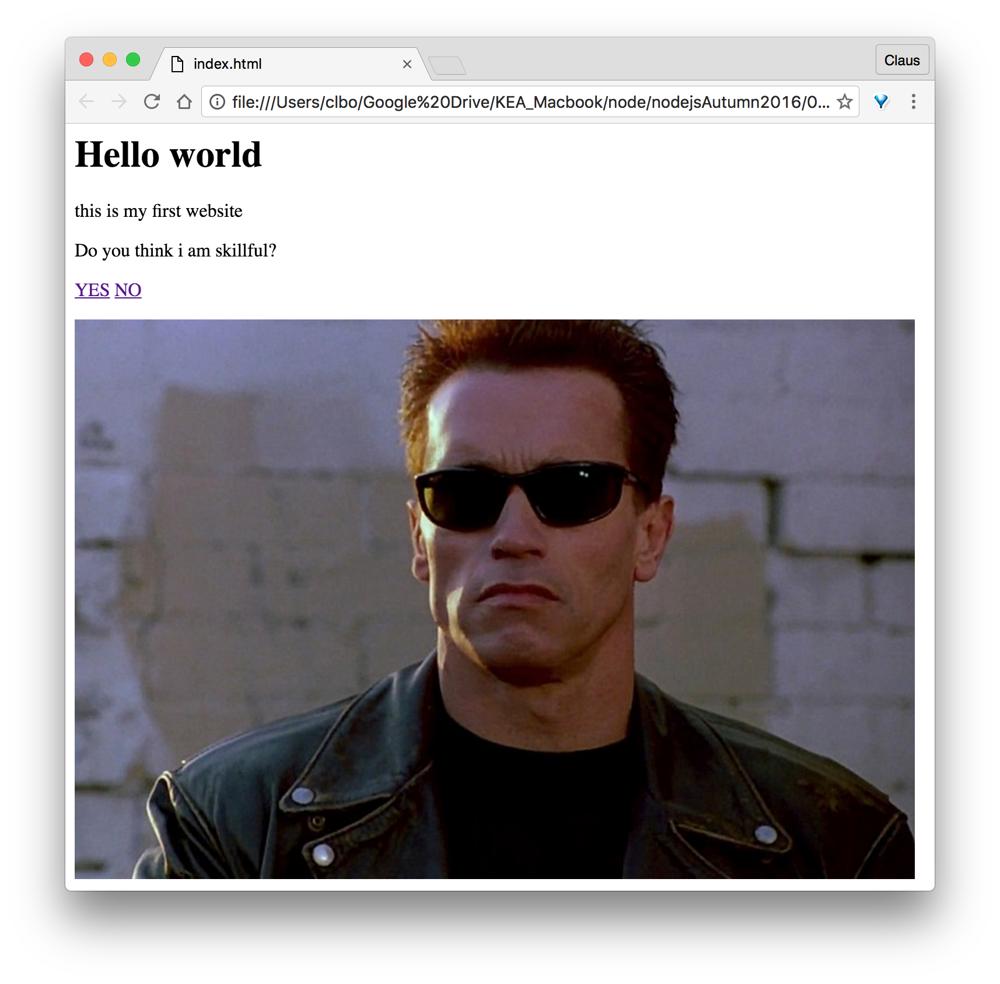

# Warm up Exercise
Create a new Spring Boot Initializer project (like we did last time) and create a Controller with an index method inside. (this is what you learned last time).    

Create an index.html file that looks like this:    

_help can be found here: https://www.w3schools.com/html/html_basic.asp_

_
&copy; clbo@kea.dk
_
